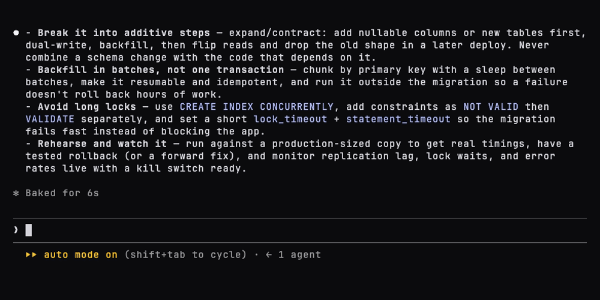

<div align="center">

# ai-prompt-search

**Every prompt you have ever typed, across every AI CLI, in one searchable picker.**

Stop pressing ↑ two hundred times. Type three words, hit enter, it is on your clipboard.



<sub><code>ctrl-p</code> inside a real Claude Code session. The picker is scoped to a throwaway project seeded with invented prompts, so the recording carries nobody's actual work — the same scoping that keeps your other projects off your screen. <a href="docs/demo.tape">docs/demo.tape</a> is the script.</sub>

</div>

```sh
npm i -g ai-prompt-search
aps install          # aliases your agents, once
exec zsh
```

<div align="center">

## Press <kbd>ctrl</kbd> + <kbd>p</kbd>

**inside `claude`, `codex` or `opencode` — the picker opens over your live session.**

Type a few words · <kbd>↑</kbd><kbd>↓</kbd> to move · <kbd>enter</kbd> types it in ·
<kbd>ctrl</kbd>+<kbd>a</kbd> widens the search · <kbd>esc</kbd> closes

</div>

Or on its own, without an agent running:

```sh
aps                  # the picker, in any terminal
```

<div align="center">


</div>

<div align="center">

`aps` reads the prompt history **already on your machine**. No account, no index to build,
no daemon, no telemetry, and **zero runtime dependencies**.

</div>

---

## The picker

```
04-23 18:07 codex     [Nest] 85576 - 04/24/2026, 2:05:38 AM LOG [UptimeService] Current…
08-05 16:33 claude    ok tell me after the recording is finished put it on the README ok?
08-09 12:48 claude    I use vitrine there for the video https://github.com/rhyumiranda/…
08-09 13:16 claude    DO NOT LOGIN, I did not login anythign when the AI recording the s…
08-09 17:54 claude    then redo the recording fix everything
08-10 17:39 claude    yeah its fine now, next can we redo the recording? people should s…
08-13 16:54 claude    nah dont touch the recordings, I just want when I use nacre serve …

  7 shown  ·  ↑↓ move  ·  ⏎ copy  ·  esc quit
  search recording
```

Type to filter live. `⏎` copies the highlighted prompt and quits. `esc` leaves.

**The list grows upward.** The newest, most likely match sits at the bottom, directly
above the cursor — where your eye already is. A top-down list puts the best answer
furthest away and makes every selection start with a journey.

---

## Why this is not another session-search tool

There are several good tools for searching AI **sessions** — [agentsview](https://github.com/kenn-io/agentsview),
[cass](https://github.com/Dicklesworthstone/coding_agent_session_search), [ctx](https://github.com/ctxrs/ctx),
[agent-sessions](https://github.com/jazzyalex/agent-sessions). They all parse session
transcripts: megabytes of assistant output, tool calls and results, wrapped around the one
line you typed. They find a **conversation**.

That is a different problem. This one is *"I know roughly what I typed, give me the
sentence back so I can send it again."*

And it turns out the data for that is already sitting in a much simpler place:

| agent | file | shape |
|---|---|---|
| Claude Code | `~/.claude/history.jsonl` | `{ display, timestamp, project }` |
| Codex | `~/.codex/history.jsonl` | `{ text, ts, session_id }` |
| opencode | `storage/message/*.json` + `storage/part/<msgId>/*.json` | the record and its text are separate files |

Those first two **are** the up-arrow buffer, on disk, one record per prompt. No transcript
parsing, no filtering assistant text back out. Reading them makes the whole problem small:
twenty thousand prompts indexed in well under a second.

---

## Usage

```sh
aps                     # the picker, scoped to this project
aps deploy staging      # the picker, with a search already typed
aps -A                  # every project you have ever worked in

aps -p migration        # print instead of picking
aps -c migration        # copy the newest match, no UI
aps -a codex            # one agent only
aps --agents            # what was found on this machine
aps --json rollback     # machine-readable, for piping

aps run claude          # run it with ctrl-p bound to the picker
aps --pick              # picker on the terminal, chosen prompt to stdout
aps --hotkey            # the tmux and shell bindings to install
```

### Scoped to the pane you are in

Inside `aps run`, the picker opens on **this conversation only** — not this
project. Two panes on the same repository are one project and two sessions, and
the prompt you want back is nearly always the one you typed in the pane you are
looking at. `^a` widens: this session → this project → everywhere.

The session is learned rather than configured. Nothing in an agent's
environment says which conversation it is, but the wrapper sees your keystrokes:
a prompt is submitted with Return, so the first record to appear after one is by
construction from this pane. Until you have typed something the picker opens on
the project, because a pane you have not typed in has no conversation to show.

### Scoped to the project you are in

By default you only see prompts typed in the current repository. Your other
work — other clients, other products — stays off the screen until you ask for
it with `-A`, or `ctrl-a` inside the picker.

The scope is the **git root**, and it includes subdirectories: a prompt typed in
`atlas/src` still belongs to `atlas`. Codex does not record a directory in its
history file, so it is joined to the session that does — tens of files, about
20 ms.

One consequence worth knowing: prompts are filed under the path the project had
**at the time**. Rename a directory and its old prompts stay under the old name,
reachable with `-A`.

Piped or redirected, `aps` prints instead of drawing — a TUI that renders escape codes into
a pipe is a tool you cannot compose with anything.

### A hotkey, inside the agent

```sh
aps install             # then just keep typing `claude`, `codex`, `opencode`
```

That writes one alias per command, into your shell's rc file, inside a fenced
block it can rewrite or remove.

**Your own launcher is found too.** Plenty of people start their agent through a
shell function that sets something up first. Those are not binaries on your
`PATH`, so they cannot be detected there and cannot be spawned by name — `aps`
reads your rc file for them and runs them through your shell instead. Anything
you name yourself works the same way:

```sh
aps install my-launcher
```

Nobody is going to retype their muscle memory as `aps run claude`, so this
aliases the names you already use. `aps uninstall` puts the file back, and
`aps install --print` shows the block without touching anything.

An alias rather than a shim on `PATH`, deliberately: a shim would also intercept
scripts and CI, where a keyboard interceptor has no business being.

Press **ctrl-p** mid-conversation: the panel takes over the screen, you type a
few words, and the prompt you pick is typed into the agent as if you had typed
it yourself. No multiplexer, no terminal-specific config.

It works by being the thing in the middle. A running agent holds the keyboard in
raw mode, so nothing outside it can see a keypress — `aps run` gives the agent a
pseudo-terminal it owns and keeps only the keyboard. Everything that is not the
hotkey is forwarded byte-for-byte, and the agent keeps its own output, colour
and resizing.

**It has no colours of its own.** The panel is transparent — a border, your
terminal's own palette, and whatever is already on screen behind it. Nothing is
painted, so nothing can clash with your theme, on any scheme anyone runs. The
selected row reverses your foreground and background, which is readable by
definition; the agent dots use your palette's magenta, cyan and yellow.

That needs a pty, which Node cannot allocate on its own, so `node-pty` is an
**optional** dependency: `npm i -g ai-prompt-search` still installs nothing
required, plain `aps` never loads it, and if the prebuilt binary is unavailable
for your platform `aps run` says so and points at the tmux binding instead.

<sub>The zero-dependency route was tried first. The `script` utility can allocate a pty, but on
macOS it requires its own stdin to be a terminal — `tcgetattr/ioctl: Operation not supported on
socket` — and being in the middle means handing it a pipe.</sub>

### Or a binding, if you prefer no wrapper

```sh
aps --hotkey            # print the bindings; --hotkey tmux|zsh|bash for one
```

If you already live in tmux, a popup costs nothing extra:

```tmux
bind -n M-p display-popup -E -w 76 -h 16 'p=$(aps --pick) && tmux send-keys -l -- "$p"'
```

`alt-p` opens the picker in a popup over whatever is running, and the prompt you
choose is typed into it. The popup is not a pane, so the agent underneath stays
the active pane and `send-keys` reaches it; `-l` sends the text literally, so
quotes, backticks and `$` arrive as themselves.

**At a shell prompt**, where the shell does own the keyboard, `aps --hotkey zsh`
prints a `zle` widget that puts the chosen prompt on the command line.

Both rest on `aps --pick`: the panel is drawn on `/dev/tty` and the chosen prompt
goes to stdout, so `chosen=$(aps --pick)` gets the text rather than the
interface. It exits non-zero when you press escape, so a binding can tell
*cancelled* from *picked nothing*.

### Agents are detected, never configured

```
$ aps --agents
found   Claude Code  ~/.claude
found   Codex        ~/.codex
found   opencode     ~/.local/share/opencode
```

If the directory is there, it is read. Asking you to declare your agents is asking you to
maintain a list the filesystem already knows, and to update it every time you try something
new.

---

## Two things it does on purpose

**Deduplicates.** You retype the same instruction constantly. Twenty identical rows is not
twenty results — it is one result and a frequency, shown as `x20`. The count is useful on
its own: it is a list of what you ask for most.

**Every term must match, in any order.** Nobody recalls a prompt verbatim; they recall two
or three words from it. `AND` across terms is what "I know roughly what I typed" actually
means. Fuzzy matching would trade a precise tool for an approximate one.

Slash commands, shell escapes and anything under three characters are filtered out. `/clear`
and `go` are real things you typed and useless things to search for.

---

## Limits, stated

- **Gemini CLI is not covered.** `~/.gemini/history/` exists but holds no prompt file I
  could verify — only project markers. Rather than claim coverage that does not work, it is
  absent. If you know where Gemini persists prompts, that is a welcome issue.
- **Nothing is written.** This only ever reads. Your history files are not modified, moved,
  or uploaded.

---

## Requirements

Node ≥ 20. That is the whole list.

Clipboard uses `pbcopy` on macOS, `clip` on Windows, `xclip` on Linux. If none is present,
the prompt is printed instead of copied — so it still works, it just costs you a
select-and-copy.

---

## License

Apache-2.0
